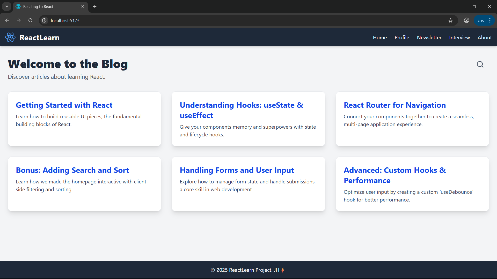
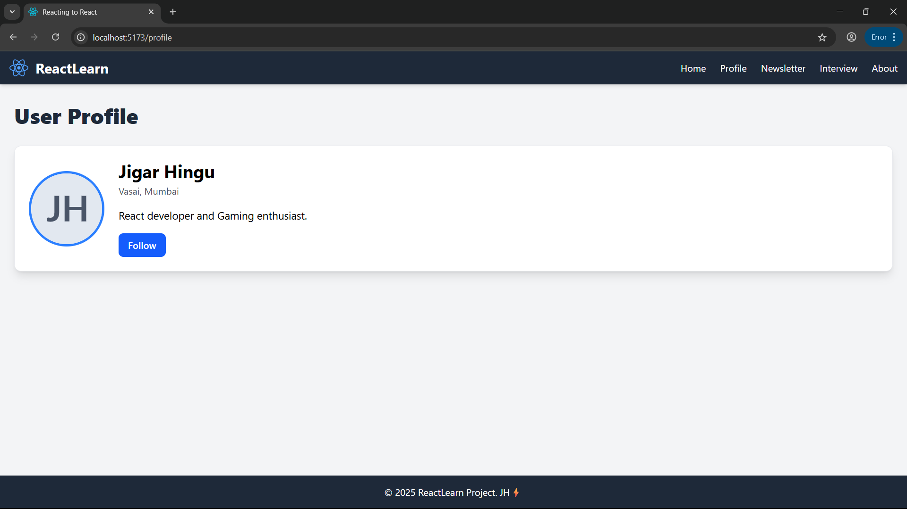
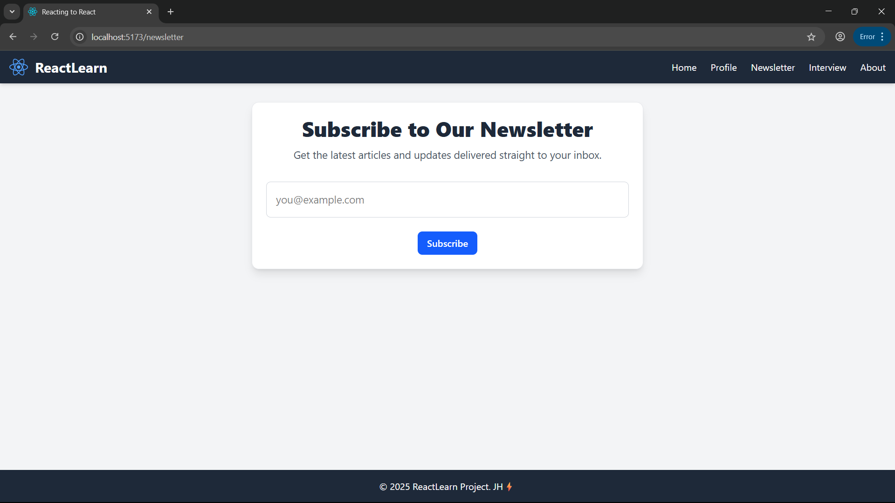
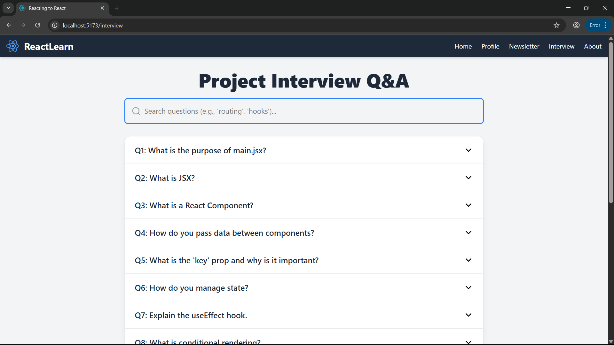
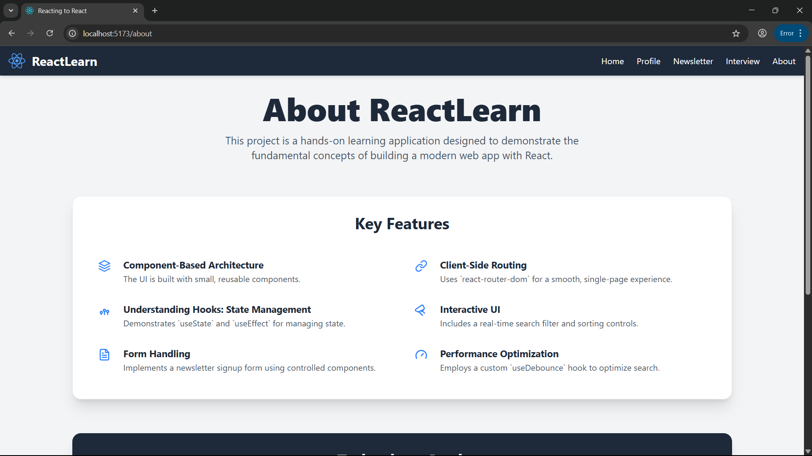
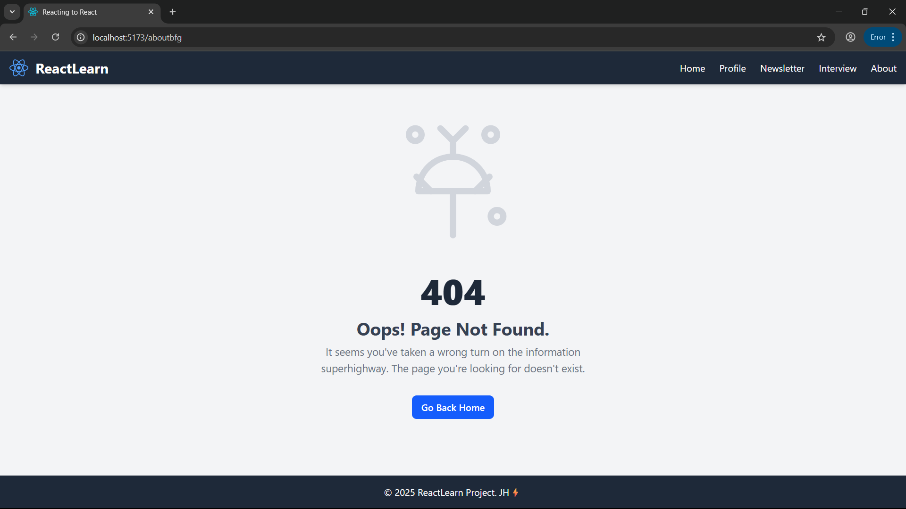

# 📘 ReactLearn: A Hands-On Learning Project

**ReactLearn** is a feature-rich, single-page application built from the ground up to serve as a hands-on learning tool for core React concepts. It's designed to be a practical example for beginners, covering everything from project setup to advanced features like custom hooks and performance optimization.

---

## 🚀 Features

This project is a comprehensive demonstration of the following features and concepts:

### 🧩 Component-Based Architecture
- The UI is built with small, reusable, and well-structured components.

### 🧭 Client-Side Routing
Utilizes `react-router-dom` to create a smooth, multi-page experience without page reloads, including:
- Dynamic routes for individual blog posts (`/posts/:id`)
- A custom **404 Not Found** page with a playable game

### ⚛️ State Management
- Uses `useState` and `useEffect` for managing component state, fetching data, and handling side effects.

### 🎯 Interactive UI
- **Real-time Search**: A debounced search bar on the homepage to filter posts by title or content.
- **Sorting**: Controls to sort blog posts alphabetically.
- **Animated Search Panel**: A clean, slide-down panel for search and sort controls.

### ✍️ Form Handling
- Fully functional newsletter signup page
- Demonstrates form state management and user submission handling

### 🧪 Custom Hooks
- Includes a custom `useDebounce` hook to optimize search and prevent excessive re-renders.

### 📚 Interactive Documentation
- **About Page**: An interactive project overview with clickable elements.
- **Interview Q&A Page**: Searchable accordion explaining each concept used in the project.

### 🌟 UX Enhancements
- Loading spinners for data-fetching states
- User feedback on actions like the "Copy" button on code snippets
- Helpful tooltips on interactive elements

---

## 🛠️ Technology Stack

- **React** – JavaScript library for building user interfaces
- **Vite** – Next-gen frontend tooling for fast development
- **Tailwind CSS** – Utility-first CSS framework
- **React Router** – Declarative client-side routing

---

## 🧰 Getting Started

To get a local copy up and running, follow these simple steps:

### 📋 Prerequisites

- Node.js (v16 or later)
- npm

### ⚙️ Installation & Setup

```bash
# Clone the repository
git clone <your-repo-url>

# Navigate into the project directory
cd react-learning-project

# Install dependencies
npm install

# Run the development server
npm run dev
```

### The application will be available at:

```bash
http://localhost:5173
```

## 📷 Screenshots

<br />
<br />
<br />
<br />
<br />
<br />

# 📘 ReactLearn: A Hands-On Learning Project

[🚀 Live Demo](https://react-web-avg3.onrender.com)

ReactLearn is a feature-rich...

## 🙌 Contributing

- Feel free to fork, open issues, or submit pull requests to enhance the project.


